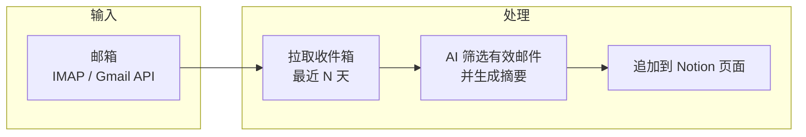
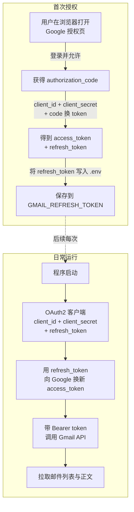

# Email → Notion Agent

从邮箱拉取有效邮件，用 AI 总结后同步到 Notion 页面。

## 流程说明

### Agent 主流程



### Gmail OAuth2 授权与调用（可选）

首次配置 Gmail 时需完成一次授权拿到 `refresh_token`，之后每次运行用 refresh_token 自动换 access_token 调 Gmail API：



## 支持邮箱

- **Outlook**（推荐）：**OAuth2 + Microsoft Graph**，无需 IMAP 与应用密码；或 IMAP + 应用密码
- Gmail：Gmail API（OAuth2）或 IMAP + 应用专用密码

## 快速开始（Outlook OAuth2，推荐）

无需应用密码，用微软账号授权一次即可。

1. **注册 Azure 应用（仅首次）**

   - 打开 [Azure 门户 → 应用注册 → 新注册](https://portal.azure.com/#blade/Microsoft_AAD_RegisteredApps/ApplicationsListBlade)
   - 名称随意（如 `email-notion-agent`），支持账户类型选 **「任何组织目录中的账户和个人 Microsoft 账户」**
   - 重定向 URI 可不填（设备码流程不需要）
   - 注册完成后进入应用 → **概述**，复制 **应用程序(客户端) ID** → 写入 `.env` 的 `OUTLOOK_CLIENT_ID`
   - 进入 **API 权限** → 添加权限 → Microsoft Graph → 委托权限 → 勾选 **Mail.Read**、**offline_access** → 授予管理员同意（个人账户可跳过）

   **若登录时报错 `This tenant has been blocked due to inactivity`（租户因长期未使用被禁用）：**
   - 用**无痕/隐私模式**打开设备码里的登录链接，并只用 **个人 Microsoft 账户**（如 xxx@outlook.com）登录，避免走到已停用的组织租户。
   - 若仍失败：当前用来登录 Azure 的账户可能绑定了已停用的租户。请用**另一个 Microsoft 账户**（或新注册一个 outlook.com）登录 [Azure 门户](https://portal.azure.com)，在该账户下**重新做一次「应用注册」**，把新应用的客户端 ID 填到 `OUTLOOK_CLIENT_ID`，再执行 `pnpm run outlook:auth`。

2. **获取 refresh_token（仅首次）**

   在项目目录执行：

   ```bash
   cd email-notion-agent
   pnpm install
   # 确保 .env 中已填 OUTLOOK_CLIENT_ID
   pnpm run outlook:auth
   ```

   按提示在浏览器打开链接、输入代码、用 **cicistream@outlook.com** 登录并同意权限。终端会输出一行 `OUTLOOK_REFRESH_TOKEN=...`，整行追加到 `.env`。

3. **配置其余 .env**

   - `OPENAI_API_KEY`、`OPENAI_BASE_URL`、`MODEL_NAME`：Qwen/总结
   - `NOTION_TOKEN`、`NOTION_PAGE_ID`：Notion MCP 写入

4. **运行**

   ```bash
   pnpm run start
   ```

## Outlook IMAP（备选）

若仍用 IMAP + 应用密码：

- `.env` 中配置 `IMAP_USER`、`IMAP_PASSWORD`（应用密码）、`IMAP_HOST=outlook.office365.com`
- 网页版 Outlook → 设置 → 同步电子邮件 → 开启 IMAP
- 不配置 `OUTLOOK_CLIENT_ID` / `OUTLOOK_REFRESH_TOKEN` 时，agent 会走 IMAP

## Notion 配置（通过 MCP）

本 agent 使用 **Notion 官方 MCP**（`@notionhq/notion-mcp-server`）写入页面，运行时会自动 `npx` 启动 MCP 服务并调用 `append-block-children` 工具。

1. 在 [Notion 集成](https://www.notion.so/my-integrations) 中新建集成，复制 **API Key** 到 `NOTION_TOKEN` 或 `NOTION_API_KEY`。
2. 打开要写入摘要的 Notion 页面，浏览器地址栏中的 URL 末尾即页面 ID（通常 32 位，可带 `-`），复制到 `NOTION_PAGE_ID`。
3. 在该 Notion 页面的右上角「…」→ 连接 → 选择你的集成，否则无法写入。

## 可选环境变量

| 变量 | 说明 |
|------|------|
| `EMAIL_DAYS` | 只处理最近 N 天的邮件，默认 7 |
| `EMAIL_ALLOW_SENDERS` | 发件人白名单，逗号分隔（如 `boss@company.com,hr@company.com`），留空则不过滤 |

## 行为说明

- 从收件箱拉取最近一段时间内的邮件（排除垃圾/已删除）。
- 用 OpenAI 筛选「有效邮件」（过滤营销、自动通知等），并生成简短摘要。
- 将摘要以标题 + 条目的形式**追加**到指定 Notion 页面。

每次运行都会在 Notion 页面末尾追加一段新的摘要块。
